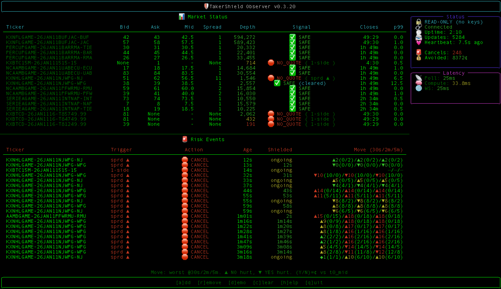

# TakerShield Observer

**Stand-down signals for Kalshi market makers. Read-only. No keys. No trading.**



---

## Read-Only by Design

- **No API keys required** — Observer never touches your Kalshi credentials
- **No trading permissions** — Cannot place, cancel, or modify orders
- **Open-source client** — Inspect every line; signals come from TakerShield brain server

This is a monitoring tool, not trading software. It shows you when conditions are dangerous—what you do with that is up to you.

---

## Quickstart (60 seconds)

```bash
# Install
pip install git+https://github.com/takershield/takershield-observer.git

# Run
takershield --token YOUR_TOKEN
```

**Adding markets:**
1. Press `a` to add
2. Paste any Kalshi market URL, e.g.:
   ```
   https://kalshi.com/markets/kxunitedcupmatch/united-cup-match/kxunitedcupmatch-26jan11swiben
   ```
3. If the event has multiple contracts, select which to observe (or `0` for all)

Check version: `pip show takershield`

Upgrade: `pip install --upgrade git+https://github.com/takershield/takershield-observer.git`

---

## What You'll See

### Market Status Table

| Column | Description |
|--------|-------------|
| **Ticker** | Kalshi market ticker |
| **Bid / Ask / Mid** | Current book prices (cents) |
| **Spread** | Ask − Bid |
| **Depth** | Contracts at top of book |
| **Signal** | SAFE / CAUTION / NO_QUOTE + trigger reason |
| **Closes** | Time until market close |
| **p99** | 99th percentile volatility (recent price moves) |

### Status Panel (top right)

- READ-ONLY indicator
- Connection status + uptime
- Updates received + heartbeat age
- **Cancels**: Count of NO_QUOTE events (would-cancel if live)
- **Avoided**: Estimated cents saved by standing down

### Latency Panel

- **Poll**: Kalshi API fetch time
- **Compute**: Risk calculation time
- **WS**: WebSocket round-trip to your terminal

### Risk Events Table

Each NO_QUOTE event logs:
- **Trigger**: What caused the signal (spread, time, volatility)
- **Age / Shielded**: How long ago, how long you were protected
- **Move (30s/2m/5m)**: Worst post-signal mid move per window. Format: `▼4(4/3)` = 4¢ max, ▼ hurts YES quoters, ▲ hurts NO quoters. Not realized P&L.

Risk Events shows the most recent 20 cancel events (rolling window). Older events age out automatically.

---

## Signals

| Signal | Meaning |
|--------|---------|
| ✅ **SAFE** | Conditions normal. No elevated risk detected. |
| ⚠️ **CAUTION** | Early warning. Liquidity thinning, volatility rising, or approaching close. |
| 🛑 **NO_QUOTE** | Conditions unsafe. Spread blowout, one-sided book, or <2 min to close. Stand down. |

Triggers are OR-logic: any single condition fires the signal.

---

## Keyboard Controls

| Key | Action |
|-----|--------|
| `a` | Add market (paste Kalshi URL or ticker) |
| `r` | Remove market |
| `d` | Demo mode (BTC 15-min markets) |
| `c` | Clear risk events |
| `q` | Quit |

---

## FAQ

**Does it place or cancel orders?**  
No. Observer is read-only. It cannot interact with Kalshi on your behalf.

**What do I need to use it?**  
A TakerShield token. That's it. No Kalshi API keys, no account linking.

**Is this trading advice?**  
No. TakerShield provides risk signals based on market microstructure. It does not recommend trades, predict outcomes, or guarantee protection. You are responsible for your own trading decisions.

---

## Troubleshooting

| Problem | Fix |
|---------|-----|
| `Invalid token` | Check token string, no extra spaces. Contact support for new token. |
| No data / empty table | Add markets with `a` key or `d` for demo. Server may be restarting. |
| Stale heartbeat (>30s) | Connection dropped. Restart observer. Check internet. |
| Markets stuck after close | Should auto-remove. Restart if persists. |

---

## Support

Email: s@takershield.com

---

## Disclaimer

TakerShield Observer provides informational risk signals only. It is not investment advice, trading advice, or a recommendation to buy or sell any contract. Past signal performance does not guarantee future results. Use at your own risk.
